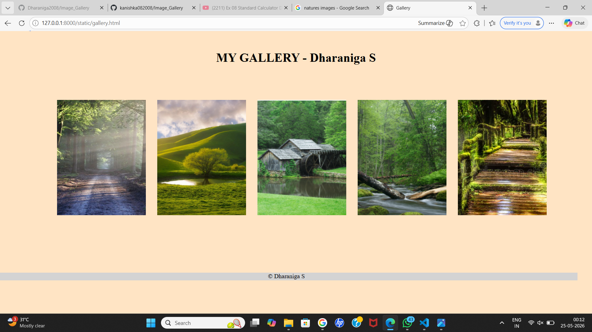

# Ex.07 Design of Interactive Image Gallery

## AIM
  To design a web application for an inteactive image gallery with minimum five images.

## DESIGN STEPS

## Step 1:

Clone the github repository and create Django admin interface

## Step 2:

Change settings.py file to allow request from all hosts.

## Step 3:

Use CSS for positioning and styling.

## Step 4:

Write JavaScript program for implementing interactivit

## Step 5:

Validate the HTML and CSS code

## Step 6:

Publish the website in the given URL.

## PROGRAM
```
<html>
    <head>
        <title>Gallery</title>
        <link rel="stylesheet" href="gallery.css">
        <script src="gallery.js"></script>
    </head>
    <body>
        <h1>MY GALLERY - Dharaniga S</h1>
        <div class="gallery">
            <div class="galleryitem">
                
            </div>
            <div class="galleryitem">
                
            </div>
            <div class="galleryitem">
                
            </div>
            <div class="galleryitem">
                
            </div>
            <div class="galleryitem">
                
            </div>
             
        </div>
        <footer class="copyrights">
            &copy; Dharaniga S
        </footer>
    </body>
</html>

gallery.css


body {
    background-color:bisque;
    text-align: center;
    margin-top: 50px;
}

.gallery {
    display: flex;
    gap: 20px;
    padding-top: 50px;
    justify-content: center;;
}

.galleryitem {
    cursor: pointer;
    text-align: center;
    width: 200px;
    padding: 20px;
}

.galleryitem img {
    width: 230px;
    height: 300px;
}

.copyrights{
    width: 1510px;
    height: 20px;
    background-color:lightgrey;
    text-align: center;
    top: 130px;
    left: -20px;
    position: relative;

}


style1.js:

function mousein()
{
    document.getElementById("Photo1").style.width="230";
    document.getElementById("Photo1").style.height="320";
}{
    document.getElementById("Photo2").style.width="300";
    document.getElementById("Photo2").style.height="400";
}
{
    document.getElementById("Photo3").style.width="280";
    document.getElementById("Photo3").style.height="400";
}
{
    document.getElementById("Photo4").style.width="280";
    document.getElementById("Photo4").style.height="400";
}
{
    document.getElementById("Photo5").style.width="280";
    document.getElementById("Photo5").style.height="400";
}

function mouseout()
{
    document.getElementById("Photo1").style.width="200";
    document.getElementById("Photo1").style.height="300";
}
{
    document.getElementById("Photo2").style.width="200";
    document.getElementById("Photo2").style.height="300";
}
{
    document.getElementById("Photo3").style.width="200";
    document.getElementById("Photo3").style.height="300";
}
{
    document.getElementById("Photo4").style.width="200";
    document.getElementById("Photo4").style.height="300";
}
{
    document.getElementById("Photo5").style.width="200";
    document.getElementById("Photo5").style.height="300";
}```


## OUTPUT



## RESULT
  The program for designing an interactive image gallery using HTML, CSS and JavaScript is executed successfully.
